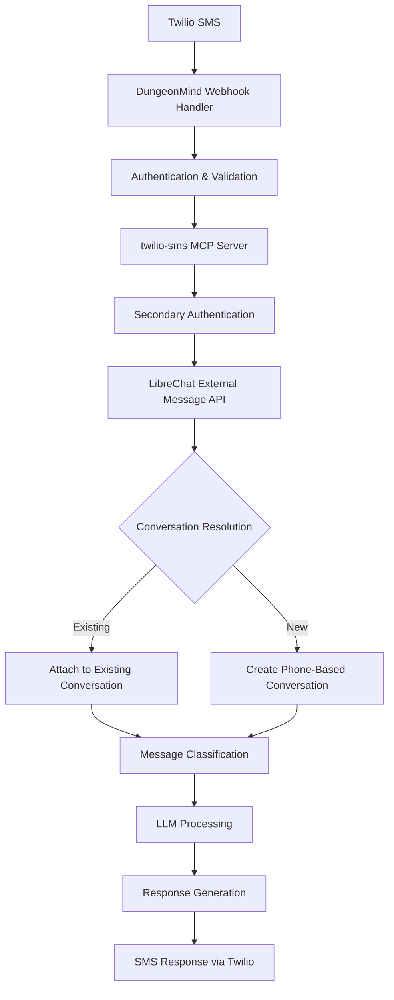

# LibreChat SMS Integration: Success Criteria & Project Goals

**Project**: Authenticated SMS Integration with LibreChat  
**Date**: June 1st, 2025  
**Status**: In Development  

---

## Project Overview

Create a complete SMS integration system that enables bidirectional SMS communication through LibreChat with intelligent conversation management, multi-level authentication, and automated message classification.

### High-Level Architecture



---

## Success Criteria

### 1. **Complete SMS Inbound Flow** ✅ **MUST WORK**

#### 1.1 Twilio → DungeonMind Integration
- **Requirement**: Receive Twilio webhooks with complete SMS metadata
- **Authentication**: Twilio signature validation
- **Metadata Captured**:
  ```json
  {
    "From": "+1234567890",
    "To": "+1098765432", 
    "Body": "SMS message content",
    "MessageSid": "unique-twilio-message-id",
    "AccountSid": "twilio-account-id",
    "ConversationId": "existing-conversation-id-if-reply",
    "Timestamp": "2025-06-01T12:00:00Z"
  }
  ```
- **Success Indicator**: All incoming SMS messages are captured with full metadata

#### 1.2 DungeonMind → MCP Server Integration  
- **Requirement**: Forward authenticated SMS data to twilio-sms MCP server
- **Authentication**: API key validation between services
- **Data Enhancement**: Add conversation context and routing metadata
- **Success Indicator**: 100% message forwarding with enhanced metadata

#### 1.3 MCP Server → LibreChat Integration
- **Requirement**: Forward authenticated messages to LibreChat external API
- **Authentication**: LibreChat external API key validation
- **Message Format**: 
  ```json
  {
    "role": "external",
    "content": "SMS message content",
    "metadata": {
      "source": "sms",
      "phoneNumber": "+1234567890",
      "twilioMessageSid": "unique-id",
      "conversationId": "uuid-if-existing",
      "title": "SMS: +1234567890",
      "endpoint": "openai",
      "model": "gpt-4o"
    }
  }
  ```
- **Success Indicator**: Messages successfully processed by LibreChat

### 2. **Intelligent Conversation Management** ✅ **MUST WORK**

#### 2.1 Existing Conversation Attachment
- **Scenario**: User previously sent SMS from LibreChat, now replying
- **Requirement**: Incoming SMS attaches to the original conversation thread
- **Implementation**: ConversationID metadata from original outbound SMS
- **Success Indicator**: SMS responses appear in original conversation context

#### 2.2 New Conversation Creation
- **Scenario**: New SMS from unknown phone number
- **Requirement**: Create new conversation with phone-based identification
- **Conversation Properties**:
  ```json
  {
    "conversationId": "uuid-generated",
    "title": "SMS: +1234567890",
    "endpoint": "openai", 
    "model": "gpt-4o",
    "metadata": {
      "source": "sms",
      "phoneNumber": "+1234567890",
      "createdVia": "inbound-sms"
    }
  }
  ```
- **Success Indicator**: Each unique phone number gets its own conversation thread

#### 2.3 Phone Number Mapping
- **Requirement**: Persistent mapping between phone numbers and conversation IDs
- **Storage**: Database table linking phone numbers to conversations
- **Functionality**: 
  - Create mapping on first SMS
  - Retrieve existing mapping for subsequent SMS
  - Handle conversation archival and cleanup
- **Success Indicator**: Consistent conversation mapping across sessions

### 3. **Message Classification System** ✅ **MUST WORK**

#### 3.1 Agent Tool Call Detection
- **Purpose**: Identify SMS intended as agent function calls
- **Pattern Recognition**:
  ```
  Examples:
  "search weather in Seattle"
  "create calendar event for 3pm"
  "@agent book flight to NYC"
  ```
- **Processing**: Route to appropriate agent endpoint instead of chat
- **Success Indicator**: Tool calls are executed, not just responded to

#### 3.2 LLM Query Classification  
- **Purpose**: Identify SMS as direct questions for AI assistant
- **Pattern Recognition**:
  ```
  Examples:
  "What's the capital of France?"
  "Explain quantum physics"
  "Help me write an email"
  ```
- **Processing**: Route to standard LibreChat LLM processing
- **Success Indicator**: Appropriate LLM responses generated

#### 3.3 Human Response Detection
- **Purpose**: Identify SMS as response to human user
- **Pattern Recognition**:
  ```
  Examples:
  "Thanks for the info!"
  "I'll call you later"
  "Meeting confirmed"
  ```
- **Processing**: Forward to human user, minimal AI processing
- **Success Indicator**: Messages routed to appropriate human recipients

### 4. **Bidirectional SMS Communication** ✅ **MUST WORK**

#### 4.1 Outbound SMS from LibreChat
- **Requirement**: Send SMS responses through Twilio
- **Implementation**: LibreChat → MCP Server → DungeonMind → Twilio
- **Metadata Preservation**: Include ConversationID for reply threading
- **Success Indicator**: AI responses delivered as SMS

#### 4.2 Threading Consistency
- **Requirement**: Maintain conversation context across SMS exchanges
- **Implementation**: ConversationID embedded in all SMS metadata
- **Success Indicator**: Multi-turn conversations work seamlessly

---

## Technical Implementation Requirements

### Authentication Chain


#### Required Environment Variables
```bash
# DungeonMind
TWILIO_AUTH_TOKEN=your-twilio-auth-token
TWILIO_WEBHOOK_SECRET=your-webhook-secret
MCP_SERVER_API_KEY=your-mcp-api-key

# MCP Server
DUNGEONMIND_API_KEY=your-dungeonmind-api-key  
LIBRECHAT_API_KEY=your-librechat-api-key
LIBRECHAT_BASE_URL=http://localhost:3080

# LibreChat
EXTERNAL_MESSAGE_API_KEY=your-external-api-key
```

### Database Schema Requirements

#### Phone Number Mapping Table
```sql
CREATE TABLE sms_conversations (
    id SERIAL PRIMARY KEY,
    phone_number VARCHAR(20) NOT NULL UNIQUE,
    conversation_id VARCHAR(36) NOT NULL,
    user_id VARCHAR(36) NOT NULL,
    created_at TIMESTAMP DEFAULT CURRENT_TIMESTAMP,
    updated_at TIMESTAMP DEFAULT CURRENT_TIMESTAMP,
    is_active BOOLEAN DEFAULT TRUE
);

CREATE INDEX idx_phone_number ON sms_conversations(phone_number);
CREATE INDEX idx_conversation_id ON sms_conversations(conversation_id);
```

#### Message Classification Table
```sql
CREATE TABLE sms_message_classification (
    id SERIAL PRIMARY KEY,
    twilio_message_sid VARCHAR(34) NOT NULL UNIQUE,
    classification ENUM('agent_tool', 'llm_query', 'human_response') NOT NULL,
    confidence_score DECIMAL(3,2),
    processing_metadata JSON,
    created_at TIMESTAMP DEFAULT CURRENT_TIMESTAMP
);
```

---

## Success Testing Scenarios

### Scenario 1: New User First SMS
1. **Input**: SMS from new phone number "+1234567890" with content "What's the weather?"
2. **Expected Flow**:
   - Twilio → DungeonMind → MCP → LibreChat
   - New conversation created with title "SMS: +1234567890"
   - Message classified as "llm_query"
   - LLM generates weather response
   - Response sent back as SMS
3. **Success Metrics**:
   - ✅ Message received and processed
   - ✅ New conversation created
   - ✅ Appropriate response generated
   - ✅ SMS response delivered

### Scenario 2: Existing Conversation Reply
1. **Input**: SMS from known phone number with ConversationID metadata
2. **Expected Flow**:
   - Message attached to existing conversation
   - Context maintained from previous messages
   - Appropriate response generated
3. **Success Metrics**:
   - ✅ Message appears in existing conversation
   - ✅ Context preserved
   - ✅ Threading maintained

### Scenario 3: Agent Tool Call
1. **Input**: SMS with content "@agent search flights to NYC"
2. **Expected Flow**:
   - Message classified as "agent_tool"
   - Routed to agent system instead of standard chat
   - Tool execution performed
   - Results returned via SMS
3. **Success Metrics**:
   - ✅ Correct classification
   - ✅ Tool execution
   - ✅ Useful results delivered

### Scenario 4: High Volume Testing
1. **Input**: 100 SMS messages within 1 minute
2. **Expected Flow**:
   - All messages processed successfully
   - No message loss
   - Appropriate conversation threading
   - Responses delivered in reasonable time
3. **Success Metrics**:
   - ✅ 100% message processing rate
   - ✅ < 30 second average response time
   - ✅ No system overload

---

## Performance Requirements

### Response Time Targets
- **SMS Processing**: < 5 seconds from receipt to LibreChat
- **LLM Response**: < 30 seconds for standard queries
- **SMS Delivery**: < 10 seconds for outbound messages
- **End-to-End**: < 45 seconds total response time

### Reliability Targets
- **Uptime**: 99.9% availability
- **Message Delivery**: 99.95% success rate
- **Error Recovery**: Automatic retry for failed messages
- **Monitoring**: Real-time alerting for system issues

### Scalability Requirements
- **Concurrent SMS**: Handle 1000+ simultaneous SMS conversations
- **Daily Volume**: Process 10,000+ SMS messages per day
- **User Growth**: Support 1000+ unique phone numbers
- **Geographic**: Multi-region Twilio number support

---

## Monitoring & Analytics

### Required Metrics
- SMS volume (inbound/outbound)
- Response times at each stage
- Classification accuracy rates
- Conversation creation vs. attachment rates
- Error rates and failure points
- User engagement patterns

### Alerting Criteria
- Authentication failures
- Message processing failures
- Response time degradation
- High error rates
- System resource exhaustion

---

## Security & Privacy Requirements

### Data Protection
- Phone number encryption at rest
- Message content encryption in transit
- PII handling compliance
- Data retention policies
- User consent management

### Access Control
- Multi-level API key authentication
- Role-based access to SMS data
- Audit logging for all operations
- Secure key rotation procedures

---

## Future Enhancement Opportunities

### Phase 2 Features
- **Multi-language Support**: Automatic language detection and response
- **Rich Media**: Support for images, videos, and files via MMS
- **Group SMS**: Handle group conversation threads
- **Voice Integration**: SMS to voice transcription and responses

### Phase 3 Features  
- **Analytics Dashboard**: Real-time SMS conversation analytics
- **Custom Agent Workflows**: User-defined SMS automation
- **Integration APIs**: Third-party system integration
- **Advanced Classification**: Machine learning-based message classification

---

## Definition of Done

The SMS integration project is considered **COMPLETE** when:

1. ✅ **All authentication chains work reliably**
2. ✅ **100% SMS message processing success rate**
3. ✅ **Intelligent conversation management functioning**
4. ✅ **Message classification system operational**
5. ✅ **Bidirectional SMS communication working**
6. ✅ **All success testing scenarios pass**
7. ✅ **Performance requirements met**
8. ✅ **Monitoring and alerting operational**
9. ✅ **Documentation complete and accurate**
10. ✅ **Production deployment successful**

This document serves as the definitive guide for what constitutes a successful SMS integration with LibreChat. All features must be working reliably in production before the project can be considered complete. 