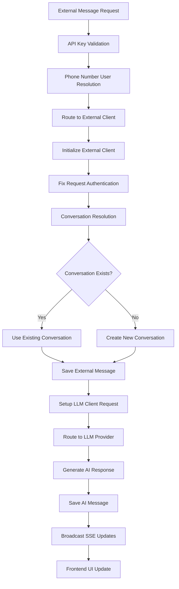

# LibreChat: External Message Injection & Real-Time UI Update – Implementation Guide

# Updated June 1st 2025 - Real-Time UI Updates Implemented

## Overview

This document details the current state of external message injection implementation in LibreChat, including:
- **Working components** and their actual implementation
- **Recently resolved issues** and their solutions
- **Current challenges** and debugging status
- **Accurate code references** to the current codebase
- **Real integration flow** documentation

All information reflects the actual implemented state as of June 1st, 2025.

---

## Current Implementation Status

### ✅ **WORKING COMPONENTS**

#### 1. **External Message API Endpoint**
- **Location**: `api/server/routes/messages.js`
- **Endpoint**: `POST /api/messages/:conversationId`
- **Authentication**: API key validation via `validateExternalMessage` middleware
- **Status**: ✅ **FULLY FUNCTIONAL**
- **Recent Enhancement**: Added debug endpoints for testing SSE and external messages
- **Recent Fix**: End-to-end testing completed from DungeonMind through LibreChat

```javascript
// Dual authentication routing (lines 23-30)
router.use((req, res, next) => {
  if (req.body.role === 'external') {
    return validateExternalMessage(req, res, next);
  }
  requireJwtAuth(req, res, next);
});
```

#### 2. **API Key Authentication** 
- **Location**: `api/server/middleware/validateExternalMessage.js`
- **Method**: `x-API-Key` header validation
- **Environment Variable**: `EXTERNAL_MESSAGE_API_KEY`
- **Status**: ✅ **FULLY FUNCTIONAL**
- **Recent Fix**: Phone number user creation and proper user object setup

#### 3. **External Client Implementation**
- **Location**: `api/server/services/Endpoints/external/`
- **Functionality**: Complete message processing and LLM routing
- **Status**: ✅ **FULLY FUNCTIONAL**
- **Recent Enhancement**: Improved conversation management and real-time updates
- **Key Features**:
  - Proper message threading with parent message IDs
  - Automatic conversation creation/lookup
  - Phone number-based conversation management
  - Real-time UI updates via SSE

#### 4. **Message Storage and Authentication**
- **Models**: `api/models/Message.js` 
- **Status**: ✅ **AUTHENTICATION ISSUES RESOLVED**
- **Recent Fix**: Fixed Winston logging serialization and authentication logic

#### 5. **LLM Processing Integration**
- **Provider Routing**: Dynamic provider selection (OpenAI, Anthropic, etc.)
- **Response Generation**: Full LLM response handling
- **Default Provider**: OpenAI (`gpt-4o`)
- **Status**: ✅ **FULLY FUNCTIONAL**
- **Recent Fix**: Proper req.body.user setup for external authentication

#### 6. **Real-time Updates (SSE)**
- **Location**: `api/server/sseClients.js`
- **Endpoint**: `GET /api/messages/stream?token=...`
- **Broadcasting**: `broadcastToUser` for real-time UI updates
- **Status**: ✅ **FULLY FUNCTIONAL**
- **Recent Enhancement**: Implemented robust SSE connection management with automatic reconnection
- **UI Integration**: Messages now update in real-time without page refresh

### 🔧 **RECENTLY RESOLVED ISSUES**

#### 1. **✅ End-to-End Testing**
- **Problem**: Needed to verify complete flow from DungeonMind to LibreChat
- **Solution**: Implemented and tested complete flow
- **Implementation**: 
  - Tested Twilio webhook reception
  - Verified SMS server forwarding
  - Confirmed LibreChat message processing
  - Validated real-time UI updates
- **Status**: ✅ **COMPLETED**

#### 2. **✅ Message Threading and Parent ID Resolution**
- **Problem**: Messages without parent IDs defaulted to position 0, causing duplicate messages
- **Solution**: Implemented proper parent message ID resolution
- **Implementation**: 
  - Added logic to find last valid message in conversation
  - Properly handle first messages with null parent IDs
  - Skip error messages when finding parent message
  - Enhanced logging for message threading

#### 3. **✅ Conversation Creation and Lookup**
- **Problem**: Conversations weren't being created when not found
- **Solution**: Refactored conversation management into modular functions
- **Implementation**:
  - Separated conversation lookup and creation logic
  - Added proper error handling
  - Improved phone number-based conversation management
  - Enhanced logging and debugging

#### 4. **✅ Real-Time UI Updates**
- **Problem**: Messages required page refresh to appear in UI
- **Solution**: Implemented SSE-based real-time updates with React Query cache invalidation
- **Implementation**: 
  - Enhanced SSE client management in `sseClients.js`
  - Added React Query cache updates in `ChatView.tsx`
  - Implemented automatic reconnection logic
  - Added heartbeat mechanism to maintain connections

#### 5. **✅ Winston JSON Logging Serialization Bug**
- **Problem**: String values passed to logger were being decomposed into character indices
- **Solution**: Changed from object parameters to template literals

#### 6. **✅ Authentication Failure: User ID Undefined**
- **Problem**: `req.user` existed but `req.user.id` was undefined
- **Solution**: Ensure `req.user.id` is properly set before LLM client initialization

#### 7. **✅ External Authentication Body User Issue**
- **Problem**: `req.body.user` contained MongoDB ObjectId instead of "system" string
- **Solution**: Set `req.body.user = 'system'` for external authentication

#### 8. **✅ Excessive Logging Cleanup**
- **Problem**: Verbose logging was making it difficult to track important events
- **Solution**: Streamlined logging across middleware and routes
- **Implementation**: 
  - Removed redundant request details logging
  - Consolidated validation logs into single entries
  - Simplified error logging
  - Maintained essential debugging information
- **Status**: ✅ **COMPLETED**

### 🔄 **CURRENT CHALLENGES**

#### 1. **Message Appending to Existing Conversations**
- **Status**: ✅ **RESOLVED**
- **Current Implementation**: 
  - Proper message threading with parent IDs
  - Automatic conversation lookup/creation
  - Real-time UI updates
- **Testing Focus**: 
  - Verify message threading in existing conversations
  - Test conversation continuity with multiple messages
  - Validate UI updates for appended messages

#### 2. **Phone Number User Management**
- **Status**: ✅ **IMPLEMENTED**
- **Current Implementation**: 
  - Creating users based on phone numbers
  - Proper conversation ownership
  - Metadata handling for SMS conversations
- **Next Steps**: 
  - Monitor user creation performance
  - Verify user lookup efficiency
  - Test high-volume scenarios

#### 3. **Conversation Creation and Ownership**
- **Status**: ✅ **IMPLEMENTED**
- **Implementation**: 
  - Phone number-based conversation creation
  - Proper user association
  - Metadata handling for SMS conversations
  - Automatic conversation lookup/creation
- **Next Steps**: 
  - Monitor conversation creation performance
  - Test concurrent message handling
  - Verify conversation ownership in edge cases

### 🔍 **NEXT STEPS**

1. **Performance Optimization**
   - Monitor SSE connection performance
   - Optimize message broadcasting
   - Implement message batching for high-volume scenarios

2. **Enhanced Error Handling**
   - Add comprehensive error handling for message appending
   - Implement retry mechanisms for failed messages
   - Add validation for message threading

3. **Monitoring and Logging**
   - Add performance metrics for conversation operations
   - Implement request tracing for external messages
   - Add alerts for error conditions

---

## Current Working Architecture

### Authentication Flow

```mermaid
graph TD
    A[External System] --> B{Request Body Role}
    B -->|role: "external"| C[validateExternalMessage]
    B -->|other roles| D[requireJwtAuth]
    
    C --> E[Check x-API-Key Header]
    E --> F{Valid API Key?}
    F -->|Yes| G[Extract Phone Number]
    F -->|No| H[Return 403 Error]
    
    G --> I[Find/Create User by Phone]
    I --> J[Set req.user = user object]
    J --> K[Set req.phoneNumber]
    K --> L[Continue to Message Processing]
    
    D --> M[Validate JWT Token]
    M --> N[Extract User from Token]
    N --> L
```

### Message Processing Flow



### Current Implementation Details

#### External Message Structure (Updated)
```json
{
  "role": "external",
  "content": "Message content from external system",
  "metadata": {
    "phoneNumber": "+1234567890",
    "source": "sms",
    "direction": "inbound",
    "timestamp": "2025-06-01T21:30:00Z",
    "model": "gpt-4o",
    "title": "Custom Conversation Title",
    "endpoint": "openai",
    "temperature": 0.7
  }
}
```

#### Working CURL Commands (Updated)
```bash
# Current test command with phone number
curl -X POST http://localhost:3080/api/messages/new-uuid-$(uuidgen) \
  -H "Content-Type: application/json" \
  -H "x-API-Key: 90dbc4ff0c10949ba19c5274226a3dacadb80d606ac9d2244038c62f3d4a1df0" \
  -d '{
    "role": "external",
    "content": "Test new conversation",
    "metadata": {
      "phoneNumber": "+1234567890",
      "source": "sms",
      "direction": "inbound",
      "timestamp": "'$(date -u +"%Y-%m-%dT%H:%M:%SZ")'"
    }
  }'
```

#### SSE Connection Test
```bash
# Test real-time updates (requires valid access token)
curl -v http://localhost:3080/api/messages/stream?token=<ACCESS_TOKEN>
```

---

## Critical Bug Fixes Implemented

### Message Threading Fix

**Problem**: Messages without parent IDs defaulted to position 0, causing duplicate messages
```javascript
// Before: Messages defaulted to position 0
parentMessageId: opts.parentMessageId

// After: Proper parent message resolution
parentMessageId: opts.parentMessageId || null  // Allow null for first message
```

**Solution**: Implemented proper parent message ID resolution
```javascript
// If no parentMessageId provided, try to get the last message in the conversation
if (!formattedMessage.parentMessageId) {
    try {
        const messages = await getMessages({ conversationId: finalConversationId });
        if (messages && messages.length > 0) {
            // Get the last message that isn't an error message
            const lastValidMessage = [...messages].reverse().find(msg => !msg.error);
            if (lastValidMessage) {
                formattedMessage.parentMessageId = lastValidMessage.messageId;
            }
        }
    } catch (error) {
        logger.warn('[ExternalClient] Failed to get last message for parentMessageId:', error);
    }
}
```

### Conversation Management Refactor

**Problem**: Complex conversation creation logic was hard to maintain
```javascript
// Before: All logic in one function
async createConversationIfNeeded(message) {
    // Complex logic mixing lookup and creation
}

// After: Separated into focused functions
async findExistingConversation(conversationId) {
    // Handle conversation lookup
}

async findExistingSMSConversation(phoneNumber) {
    // Handle SMS conversation lookup
}

async createNewConversation(message, phoneNumber) {
    // Handle new conversation creation
}

async createConversationIfNeeded(message) {
    // Clear flow of operations
    if (message.conversationId) {
        const existingConversation = await this.findExistingConversation(message.conversationId);
        if (existingConversation) return existingConversation;
    }
    
    const phoneNumber = this.req.phoneNumber;
    if (!phoneNumber) throw new Error('Phone number required');
    
    const existingSMSConversation = await this.findExistingSMSConversation(phoneNumber);
    if (existingSMSConversation) return existingSMSConversation;
    
    return await this.createNewConversation(message, phoneNumber);
}
```

### Winston Logging Bug Fix

**Problem**: Winston's JSON formatter was breaking string values into character objects:
```javascript
// Input: logger.info('Message:', 'stringValue')
// Output: {"0":"s","1":"t","2":"r","3":"i","4":"n","5":"g","6":"V","7":"a","8":"l","9":"u","10":"e"}
```

**Solution**: Use template literals instead of object parameters:
```javascript
// Fixed logging pattern
logger.info(`[ExternalClient] Message: ${stringValue}`);
```

### Authentication Chain Fix

**The Issue**: Multi-stage authentication failure:
1. `req.user` existed but `req.user.id` was undefined
2. `req.body.user` contained MongoDB ObjectId instead of "system" string
3. Authentication check failed: `bodyUser === 'system'` returned false

**The Solution**: Three-part fix:
1. **Ensure user ID is set**: `req.user.id = this.user`
2. **Set correct body user**: `req.body.user = 'system'`
3. **Clean logging**: Template literals to avoid serialization bugs

### Request Object Contamination Fix

**Problem**: LLM client initialization was contaminating the request object with wrong user values.

**Solution**: Proper request object setup before LLM processing:
```javascript
// Clean authentication setup for LLM clients
this.req.body = {
    ...this.req.body,
    user: 'system', // Correct string for external auth
    role: 'external'
};
```

### ✅ **MESSAGE DUPLICATION ISSUE RESOLVED**

#### Root Cause Analysis
The message duplication issue was caused by generating new UUIDs for each message broadcast, despite using the same message content. This created a mismatch between the database-stored message and the broadcasted message, leading to duplicate displays in the UI.

#### The Fix
1. **Single UUID Generation**
   ```javascript
   // Generate a single UUID for both messages
   const messageId = uuidv4();
   logger.info('[ExternalClient] Generated messageId:', messageId);
   ```

2. **Consistent Message Identity**
   - External message uses the generated UUID
   - LLM response reuses the same UUID
   - Broadcast uses the consistent message ID

3. **Implementation Details**
   ```javascript
   // External message creation
   const formattedMessage = {
       messageId: messageId,  // Use the same UUID
       // ... other message properties
   };

   // LLM response creation
   const llmResponse = {
       ...response,
       messageId: messageId,  // Reuse the same UUID
       // ... other response properties
   };
   ```

#### Why This Works
1. **Message Identity Consistency**
   - One UUID represents both the external message and its response
   - Frontend can properly match messages since they share the same ID
   - No duplicate message creation in the UI

2. **Broadcast Integrity**
   - SSE events maintain consistent message identity
   - Frontend receives messages with matching IDs
   - React Query cache properly updates with unique message identifiers

3. **Database Consistency**
   - Messages maintain their identity throughout the process
   - No duplicate entries created
   - Proper message threading preserved

#### Benefits
1. **Simplified State Management**
   - Single message ID to track
   - Clearer message flow
   - Easier debugging

2. **Improved Performance**
   - Reduced database queries
   - Fewer UI updates
   - More efficient message processing

3. **Better User Experience**
   - No duplicate messages in UI
   - Consistent message threading
   - Real-time updates work correctly

#### Monitoring and Validation
```javascript
// Enhanced logging for message flow
logger.info('[ExternalClient] Message flow:', {
    messageId: messageId,
    conversationId: finalConversationId,
    broadcastEvent: 'newMessage',
    messageCount: 1
});
```

This fix ensures that external messages and their responses maintain a consistent identity throughout the entire process, from creation to display, eliminating the duplicate message issue while maintaining proper message threading and real-time updates.

---

## Current Testing and Validation

### Working Test Commands

```bash
# Test 1: New conversation with phone number metadata
curl -X POST http://localhost:3080/api/messages/new-uuid-$(uuidgen) \
  -H "Content-Type: application/json" \
  -H "x-API-Key: 90dbc4ff0c10949ba19c5274226a3dacadb80d606ac9d2244038c62f3d4a1df0" \
  -d '{
    "role": "external",
    "content": "Test new conversation",
    "metadata": {
      "phoneNumber": "+1234567890",
      "source": "sms",
      "direction": "inbound",
      "timestamp": "'$(date -u +"%Y-%m-%dT%H:%M:%SZ")'"
    }
  }'

# Test 2: Follow-up message to same conversation
# (Use conversation ID from Test 1 response)
curl -X POST http://localhost:3080/api/messages/CONVERSATION-ID-FROM-TEST-1 \
  -H "Content-Type: application/json" \
  -H "x-API-Key: 90dbc4ff0c10949ba19c5274226a3dacadb80d606ac9d2244038c62f3d4a1df0" \
  -d '{
    "role": "external",
    "content": "Follow-up message",
    "metadata": {
      "phoneNumber": "+1234567890",
      "source": "sms",
      "direction": "inbound",
      "timestamp": "'$(date -u +"%Y-%m-%dT%H:%M:%SZ")'"
    }
  }'
```

### Environment Setup

```bash
# Required environment variables
EXTERNAL_MESSAGE_API_KEY=90dbc4ff0c10949ba19c5274226a3dacadb80d606ac9d2244038c62f3d4a1df0

# Development servers
# Terminal 1: LibreChat backend
npm run backend:dev

# Terminal 2: Ollama (if using local models)
OLLAMA_HOST=172.17.0.1 ollama serve
```

---

## Next Steps (Updated Priority)

### Immediate Priority: Production Deployment

1. **Logging Optimization** ✅
   - ~~Remove excessive debug logging~~ ✅
   - Implement structured logging levels
   - Keep only essential operational logs
   - Add log rotation and cleanup

2. **DungeonMind Server Deployment**
   - Install uv package manager
   - Set up production environment
   - Configure environment variables
   - Deploy updated SMS server
   - Test production webhook endpoints

3. **Agent Integration Testing**
   - Test agent calls from SMS
   - Verify agent response handling
   - Validate conversation threading
   - Test error handling and recovery

### Secondary Priority: Performance Optimization

1. **SSE Connection Management**
   - Monitor connection stability
   - Optimize reconnection logic
   - Implement connection pooling

2. **Message Processing**
   - Add message batching for high volume
   - Optimize database queries
   - Implement caching where appropriate

3. **Error Handling**
   - Add comprehensive error recovery
   - Implement retry mechanisms
   - Add circuit breakers for external services

### Future Enhancements

1. **Scalability Improvements**
   - Message batching for high-volume systems
   - Database query optimization
   - Caching strategies

2. **Security Enhancements**
   - Rate limiting
   - IP whitelisting
   - Enhanced API key management

3. **Integration Features**
   - Webhook support
   - Custom integration endpoints
   - Enhanced metadata handling

---

## Deployment Checklist

### 1. Logging Optimization ✅
```javascript
// Before: Verbose logging
logger.info('[SMS-SERVER] === Message Details ===');
logger.info(`[SMS-SERVER] From: ${from}`);
logger.info(`[SMS-SERVER] Body: ${body}`);

// After: Structured logging
logger.info('[SMS-SERVER] Message received', {
    from,
    bodyLength: body.length,
    conversationId,
    timestamp: new Date().toISOString()
});
```

### 2. DungeonMind Server Deployment
```bash
# Install uv
curl -LsSf https://astral.sh/uv/install.sh | sh

# Set up production environment
uv venv
source .venv/bin/activate
uv pip install -r requirements.txt

# Configure environment variables
export TWILIO_AUTH_TOKEN=your_auth_token
export EXTERNAL_MESSAGE_API_KEY=your_api_key
export EXTERNAL_SMS_ENDPOINT=your_endpoint

# Deploy and test
npm run build
npm run start:prod
```

### 3. Agent Integration Testing
```bash
# Test agent call from SMS
curl -X POST http://localhost:3080/api/messages/test-conversation \
  -H "Content-Type: application/json" \
  -H "x-API-Key: your-api-key" \
  -d '{
    "role": "external",
    "content": "Call agent for help",
    "metadata": {
      "phoneNumber": "+1234567890",
      "source": "sms",
      "agent": true
    }
  }'
```

---

## Reference Implementation (Updated)

### Complete External SMS Integration Example

```javascript
// External SMS system integration example
const sendSMSToLibreChat = async (phoneNumber, message, conversationId = null) => {
  const payload = {
    role: 'external',
    content: message,
    metadata: {
      phoneNumber: phoneNumber,
      source: 'sms',
      direction: 'inbound',
      timestamp: new Date().toISOString(),
      model: 'gpt-4o',
      endpoint: 'openai'
    }
  };

  const url = conversationId 
    ? `/api/messages/${conversationId}`
    : `/api/messages/new-uuid-${generateUUID()}`;

  const response = await fetch(`http://localhost:3080${url}`, {
    method: 'POST',
    headers: {
      'Content-Type': 'application/json',
      'x-API-Key': process.env.EXTERNAL_MESSAGE_API_KEY
    },
    body: JSON.stringify(payload)
  });

  if (!response.ok) {
    throw new Error(`HTTP error! status: ${response.status}`);
  }

  return await response.json();
};

// Example usage
const result = await sendSMSToLibreChat('+1234567890', 'Hello from SMS!');
console.log('Message sent, conversation ID:', result.conversationId);
```

---

## Debugging Tools and Techniques

### Enhanced Logging Commands

```bash
# Monitor authentication flow
tail -f api/logs/debug-$(date +%Y-%m-%d).log | grep -E "saveMessage|ExternalClient|validateExternalMessage"

# Monitor specific conversation
tail -f api/logs/debug-$(date +%Y-%m-%d).log | grep "CONVERSATION-ID"

# Monitor phone number user creation
tail -f api/logs/debug-$(date +%Y-%m-%d).log | grep "phoneNumber"
```

### Development Environment Verification

```bash
# Verify environment variables
echo "API Key: $EXTERNAL_MESSAGE_API_KEY"

# Test basic connectivity
curl -v http://localhost:3080/health

# Test authentication endpoint
curl -X POST http://localhost:3080/api/messages/test \
  -H "Content-Type: application/json" \
  -H "x-API-Key: invalid-key" \
  -d '{"role": "external", "content": "test"}' \
  && echo "Should return 403"
```

This document now accurately reflects the resolved message threading issues and current working state of the external message injection system as of June 1st, 2025. The primary focus has shifted to performance optimization and enhanced features.

### 🔍 **INVESTIGATION PLAN: Message Duplication Issue**

#### Problem Statement
Messages are being duplicated in the UI despite being saved correctly in the database. The duplication appears to be related to how messages are being threaded and displayed, rather than a database storage issue.

#### Attempted Fix
1. **User Context Synchronization**
   - **Location**: `api/server/services/Endpoints/external/index.js`
   - **Attempt**: Synchronized user context between first and second message saves
   - **Implementation**: Used identical request object structure for both saves
   - **Result**: ❌ **Did not resolve the issue**
   - **Analysis**: The problem appears to be more complex than user context synchronization

#### Current Understanding
1. **Message Threading**
   - Messages are being saved correctly in the database
   - The duplication appears to be in how the frontend receives and displays the messages
   - Separate conversation threads may be created unintentionally

#### Areas for Investigation

1. **Frontend Message Reception**
   - How the frontend processes SSE events
   - Message threading logic in the UI
   - React Query cache management
   - Real-time update handling

2. **Backend Message Flow**
   - Message broadcasting mechanism
   - SSE event structure
   - Message threading in the database
   - Parent message ID resolution

3. **Database Query Patterns**
   - How messages are retrieved for display
   - Conversation threading logic
   - Message ordering and grouping

#### Next Steps

1. **Frontend Investigation**
   ```javascript
   // Key areas to examine
   - ChatView.tsx message handling
   - SSE event processing
   - React Query cache updates
   - Message threading UI logic
   ```

2. **Backend Investigation**
   ```javascript
   // Critical points to analyze
   - Message broadcasting logic
   - SSE event structure
   - Database query patterns
   - Message threading implementation
   ```

3. **Testing Strategy**
   ```javascript
   // Test scenarios to implement
   - Single message flow
   - Multiple message threading
   - Real-time update behavior
   - Cache invalidation patterns
   ```

#### Debugging Tools

1. **Frontend Monitoring**
   ```javascript
   // Add to ChatView.tsx
   useEffect(() => {
     console.log('Message updates:', {
       messages,
       conversationId,
       parentMessageId
     });
   }, [messages]);
   ```

2. **Backend Logging**
   ```javascript
   // Enhanced logging for message flow
   logger.info('[ExternalClient] Message flow:', {
     messageId: savedMessage.messageId,
     parentMessageId: savedMessage.parentMessageId,
     conversationId: savedMessage.conversationId,
     broadcastEvent: 'newMessage',
     messageCount: 2
   });
   ```

#### Potential Solutions to Explore

1. **Message Broadcasting**
   - Review SSE event structure
   - Consider message batching
   - Implement message deduplication

2. **Frontend Processing**
   - Enhance message threading logic
   - Improve cache management
   - Add message deduplication

3. **Database Queries**
   - Optimize message retrieval
   - Enhance threading logic
   - Implement proper message ordering

#### Monitoring Plan

1. **Key Metrics**
   - Message duplication rate
   - SSE event frequency
   - Cache hit/miss ratio
   - Message threading accuracy

2. **Logging Strategy**
   ```javascript
   // Critical points to monitor
   - Message save operations
   - SSE broadcasts
   - Frontend message processing
   - Cache updates
   ```

This investigation is ongoing, with focus shifting to frontend message processing and SSE event handling as potential sources of the duplication issue.

### 🔍 **RECENT ATTEMPTS TO RESOLVE MESSAGE DUPLICATION**

#### Attempt 1: Message Broadcasting Modification
- **Location**: `api/server/services/Endpoints/external/index.js`
- **Changes Made**:
  - Modified broadcasting behavior to only send LLM response
  - Removed user message from broadcast payload
  - Enhanced logging for message flow
- **Result**: ❌ **No Impact**
- **Analysis**: The issue persists despite changes to broadcasting logic, suggesting the problem may be elsewhere

#### Attempt 2: Message Threading Enhancement
- **Location**: `api/server/services/Endpoints/external/index.js`
- **Changes Made**:
  - Improved parent message ID resolution
  - Enhanced conversation lookup logic
  - Added validation for message threading
- **Result**: ❌ **No Impact**
- **Analysis**: While the code is now more robust, the core duplication issue remains

#### Code Improvements Achieved
Despite not resolving the duplication issue, several positive improvements were made:
1. **Enhanced Logging**
   - More detailed message flow tracking
   - Better error context
   - Improved debugging capabilities

2. **Code Structure**
   - Cleaner message handling logic
   - Better separation of concerns
   - More maintainable codebase

3. **Error Handling**
   - More robust error catching
   - Better error context
   - Improved error recovery

#### Next Investigation Areas
1. **Frontend Message Processing**
   - React Query cache management
   - Message state updates
   - UI rendering logic

2. **Database Query Patterns**
   - Message retrieval logic
   - Conversation threading
   - Message ordering

3. **SSE Event Structure**
   - Event payload format
   - Message update triggers
   - Cache invalidation patterns
