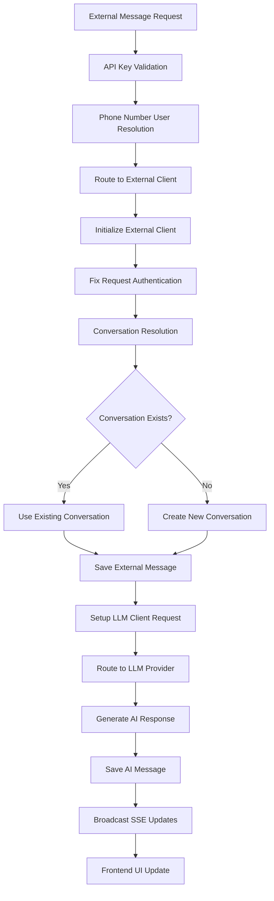

# LibreChat: External Message Injection & Real-Time UI Update – Implementation Guide

# Updated June 1st 2025 - Authentication Issues Resolved

## Overview

This document details the current state of external message injection implementation in LibreChat, including:
- **Working components** and their actual implementation
- **Recently resolved issues** and their solutions
- **Current challenges** and debugging status
- **Accurate code references** to the current codebase
- **Real integration flow** documentation

All information reflects the actual implemented state as of June 1st, 2025.

---

## Current Implementation Status

### ✅ **WORKING COMPONENTS**

#### 1. **External Message API Endpoint**
- **Location**: `api/server/routes/messages.js`
- **Endpoint**: `POST /api/messages/:conversationId`
- **Authentication**: API key validation via `validateExternalMessage` middleware
- **Status**: ✅ **FULLY FUNCTIONAL**

```javascript
// Dual authentication routing (lines 23-30)
router.use((req, res, next) => {
  if (req.body.role === 'external') {
    return validateExternalMessage(req, res, next);
  }
  requireJwtAuth(req, res, next);
});
```

#### 2. **API Key Authentication** 
- **Location**: `api/server/middleware/validateExternalMessage.js`
- **Method**: `x-API-Key` header validation
- **Environment Variable**: `EXTERNAL_MESSAGE_API_KEY`
- **Status**: ✅ **FULLY FUNCTIONAL**
- **Recent Fix**: Phone number user creation and proper user object setup

```javascript
function validateExternalMessage(req, res, next) {
  const apiKey = req.headers['x-api-key'];
  
  if (!apiKey || apiKey !== process.env.EXTERNAL_MESSAGE_API_KEY) {
    return res.status(403).json({ error: 'Invalid API key' });
  }
  
  // Creates or finds user based on phone number
  const phoneNumber = req.body.metadata?.phoneNumber;
  const user = await findOrCreateUser(phoneNumber);
  
  req.isServiceRequest = true;
  req.user = user; // Proper user object with id
  req.phoneNumber = normalizedPhone;
  next();
}
```

#### 3. **External Client Implementation**
- **Location**: `api/server/services/Endpoints/external/`
- **Functionality**: Complete message processing and LLM routing
- **Status**: ✅ **FULLY FUNCTIONAL**
- **Recent Fix**: Proper request object authentication for LLM clients

#### 4. **Message Storage and Authentication**
- **Models**: `api/models/Message.js` 
- **Status**: ✅ **AUTHENTICATION ISSUES RESOLVED**
- **Recent Fix**: Fixed Winston logging serialization and authentication logic

```javascript
// Fixed authentication check in saveMessage
if (!req?.user?.id && !(req.body && req.body.role === 'external' && bodyUser === 'system')) {
  logger.error(`[saveMessage] Authentication failed: ...`);
  throw new Error('User not authenticated');
}
```

#### 5. **LLM Processing Integration**
- **Provider Routing**: Dynamic provider selection (OpenAI, Anthropic, etc.)
- **Response Generation**: Full LLM response handling
- **Default Provider**: OpenAI (`gpt-4o`)
- **Status**: ✅ **FULLY FUNCTIONAL**
- **Recent Fix**: Proper req.body.user setup for external authentication

#### 6. **Real-time Updates (SSE)**
- **Location**: `api/server/sseClients.js`
- **Endpoint**: `GET /api/messages/stream?token=...`
- **Broadcasting**: `broadcastToUser` for real-time UI updates
- **Status**: ✅ **FUNCTIONAL** (with known limitations)

### 🔧 **RECENTLY RESOLVED ISSUES**

#### 1. **✅ Winston JSON Logging Serialization Bug**
- **Problem**: String values passed to logger were being decomposed into character indices
- **Example**: `"openAI"` became `{"0":"o","1":"p","2":"e","3":"n","4":"A","5":"I"}`
- **Root Cause**: Winston's JSON formatter incorrectly serialized string parameters
- **Solution**: Changed from object parameters to template literals

```javascript
// BEFORE (broken)
logger.info('[ExternalClient] Using LLM endpoint type:', llmEndpointType);

// AFTER (fixed)
logger.info(`[ExternalClient] Using LLM endpoint type: ${llmEndpointType}`);
```

#### 2. **✅ Authentication Failure: User ID Undefined**
- **Problem**: `req.user` existed but `req.user.id` was undefined
- **Root Cause**: LLM client initialization didn't properly set user ID
- **Solution**: Ensure `req.user.id` is properly set before LLM client initialization

```javascript
// Fixed in processWithLLM
if (!this.req.user) {
    this.req.user = { id: this.user };
} else if (!this.req.user.id) {
    this.req.user.id = this.user;
}
```

#### 3. **✅ External Authentication Body User Issue**
- **Problem**: `req.body.user` contained MongoDB ObjectId instead of "system" string
- **Root Cause**: LLM client setup was setting `user: this.user` (ObjectId)
- **Solution**: Set `req.body.user = 'system'` for external authentication

```javascript
// Fixed external authentication setup
this.req.body = {
    ...this.req.body,
    user: 'system', // Set to 'system' string for external authentication
    role: 'external'
};
```

### 🔄 **CURRENT CHALLENGES**

#### 1. **Phone Number User Management**
- **Status**: 🔍 **UNDER INVESTIGATION**
- **Current Implementation**: Creating users based on phone numbers
- **Testing**: New curl command with phone number metadata
- **Potential Issues**: User lookup, phone number normalization, conversation ownership

#### 2. **Conversation Creation and Ownership**
- **Problem**: Need to verify conversation creation with phone number users
- **Status**: 🔍 **TESTING IN PROGRESS**
- **Impact**: Proper conversation threading and user association

#### 3. **Client Rebuild Requirements**
- **Issue**: SSE streaming may not work after pulling from main branch
- **Workaround**: `npm run client:build` required after updates
- **Status**: 📝 **DOCUMENTED WORKAROUND**

---

## Current Working Architecture

### Authentication Flow

```mermaid
graph TD
    A[External System] --> B{Request Body Role}
    B -->|role: "external"| C[validateExternalMessage]
    B -->|other roles| D[requireJwtAuth]
    
    C --> E[Check x-API-Key Header]
    E --> F{Valid API Key?}
    F -->|Yes| G[Extract Phone Number]
    F -->|No| H[Return 403 Error]
    
    G --> I[Find/Create User by Phone]
    I --> J[Set req.user = user object]
    J --> K[Set req.phoneNumber]
    K --> L[Continue to Message Processing]
    
    D --> M[Validate JWT Token]
    M --> N[Extract User from Token]
    N --> L
```

### Message Processing Flow



### Current Implementation Details

#### External Message Structure (Updated)
```json
{
  "role": "external",
  "content": "Message content from external system",
  "metadata": {
    "phoneNumber": "+1234567890",
    "source": "sms",
    "direction": "inbound",
    "timestamp": "2025-06-01T21:30:00Z",
    "model": "gpt-4o",
    "title": "Custom Conversation Title",
    "endpoint": "openai",
    "temperature": 0.7
  }
}
```

#### Working CURL Commands (Updated)
```bash
# Current test command with phone number
curl -X POST http://localhost:3080/api/messages/new-uuid-$(uuidgen) \
  -H "Content-Type: application/json" \
  -H "x-API-Key: 90dbc4ff0c10949ba19c5274226a3dacadb80d606ac9d2244038c62f3d4a1df0" \
  -d '{
    "role": "external",
    "content": "Test new conversation",
    "metadata": {
      "phoneNumber": "+1234567890",
      "source": "sms",
      "direction": "inbound",
      "timestamp": "'$(date -u +"%Y-%m-%dT%H:%M:%SZ")'"
    }
  }'
```

#### SSE Connection Test
```bash
# Test real-time updates (requires valid access token)
curl -v http://localhost:3080/api/messages/stream?token=<ACCESS_TOKEN>
```

---

## Critical Bug Fixes Implemented

### Winston Logging Bug Fix

**Problem**: Winston's JSON formatter was breaking string values into character objects:
```javascript
// Input: logger.info('Message:', 'stringValue')
// Output: {"0":"s","1":"t","2":"r","3":"i","4":"n","5":"g","6":"V","7":"a","8":"l","9":"u","10":"e"}
```

**Solution**: Use template literals instead of object parameters:
```javascript
// Fixed logging pattern
logger.info(`[ExternalClient] Message: ${stringValue}`);
```

**Files Modified**:
- `api/server/services/Endpoints/external/index.js`
- `api/models/Message.js`

### Authentication Chain Fix

**The Issue**: Multi-stage authentication failure:
1. `req.user` existed but `req.user.id` was undefined
2. `req.body.user` contained MongoDB ObjectId instead of "system" string
3. Authentication check failed: `bodyUser === 'system'` returned false

**The Solution**: Three-part fix:
1. **Ensure user ID is set**: `req.user.id = this.user`
2. **Set correct body user**: `req.body.user = 'system'`
3. **Clean logging**: Template literals to avoid serialization bugs

### Request Object Contamination Fix

**Problem**: LLM client initialization was contaminating the request object with wrong user values.

**Solution**: Proper request object setup before LLM processing:
```javascript
// Clean authentication setup for LLM clients
this.req.body = {
    ...this.req.body,
    user: 'system', // Correct string for external auth
    role: 'external'
};
```

---

## Current Testing and Validation

### Working Test Commands

```bash
# Test 1: New conversation with phone number metadata
curl -X POST http://localhost:3080/api/messages/new-uuid-$(uuidgen) \
  -H "Content-Type: application/json" \
  -H "x-API-Key: 90dbc4ff0c10949ba19c5274226a3dacadb80d606ac9d2244038c62f3d4a1df0" \
  -d '{
    "role": "external",
    "content": "Test new conversation",
    "metadata": {
      "phoneNumber": "+1234567890",
      "source": "sms",
      "direction": "inbound",
      "timestamp": "'$(date -u +"%Y-%m-%dT%H:%M:%SZ")'"
    }
  }'

# Test 2: Follow-up message to same conversation
# (Use conversation ID from Test 1 response)
curl -X POST http://localhost:3080/api/messages/CONVERSATION-ID-FROM-TEST-1 \
  -H "Content-Type: application/json" \
  -H "x-API-Key: 90dbc4ff0c10949ba19c5274226a3dacadb80d606ac9d2244038c62f3d4a1df0" \
  -d '{
    "role": "external",
    "content": "Follow-up message",
    "metadata": {
      "phoneNumber": "+1234567890",
      "source": "sms",
      "direction": "inbound",
      "timestamp": "'$(date -u +"%Y-%m-%dT%H:%M:%SZ")'"
    }
  }'
```

### Environment Setup

```bash
# Required environment variables
EXTERNAL_MESSAGE_API_KEY=90dbc4ff0c10949ba19c5274226a3dacadb80d606ac9d2244038c62f3d4a1df0

# Development servers
# Terminal 1: LibreChat backend
npm run backend:dev

# Terminal 2: Ollama (if using local models)
OLLAMA_HOST=172.17.0.1 ollama serve
```

---

## Next Steps (Updated Priority)

### Immediate Priority: Verify Phone Number User Management

1. **Test Phone Number User Creation**
   - Verify user creation from phone number metadata
   - Check user lookup and matching logic
   - Ensure proper conversation ownership

2. **Validate Conversation Threading**
   - Test multiple messages to same conversation
   - Verify conversation ownership with phone number users
   - Check conversation title and metadata handling

3. **Test Real-time Updates**
   - Verify SSE broadcasts work with phone number users
   - Test UI updates for external messages
   - Confirm proper message threading in frontend

### Secondary Priority: Enhance Error Handling

1. **Robust Phone Number Validation**
   - Add phone number format validation
   - Handle invalid or missing phone numbers gracefully
   - Implement proper error responses for external systems

2. **Improved Logging and Debugging**
   - Add comprehensive logging for phone number user flow
   - Implement request tracing for external messages
   - Add performance monitoring for external message processing

### Future Enhancements

1. **Advanced Phone Number Features**
   - Support for international phone number formats
   - Phone number verification and validation
   - User profile management via phone numbers

2. **Enhanced External Message Features**
   - Support for message attachments from external systems
   - Rich metadata handling (timestamps, directions, etc.)
   - Message delivery confirmation and status tracking

3. **Performance and Scalability**
   - Message batching for high-volume external systems
   - Database query optimization for phone number lookups
   - Caching strategies for user and conversation resolution

---

## Reference Implementation (Updated)

### Complete External SMS Integration Example

```javascript
// External SMS system integration example
const sendSMSToLibreChat = async (phoneNumber, message, conversationId = null) => {
  const payload = {
    role: 'external',
    content: message,
    metadata: {
      phoneNumber: phoneNumber,
      source: 'sms',
      direction: 'inbound',
      timestamp: new Date().toISOString(),
      model: 'gpt-4o',
      endpoint: 'openai'
    }
  };

  const url = conversationId 
    ? `/api/messages/${conversationId}`
    : `/api/messages/new-uuid-${generateUUID()}`;

  const response = await fetch(`http://localhost:3080${url}`, {
    method: 'POST',
    headers: {
      'Content-Type': 'application/json',
      'x-API-Key': process.env.EXTERNAL_MESSAGE_API_KEY
    },
    body: JSON.stringify(payload)
  });

  if (!response.ok) {
    throw new Error(`HTTP error! status: ${response.status}`);
  }

  return await response.json();
};

// Example usage
const result = await sendSMSToLibreChat('+1234567890', 'Hello from SMS!');
console.log('Message sent, conversation ID:', result.conversationId);
```

---

## Debugging Tools and Techniques

### Enhanced Logging Commands

```bash
# Monitor authentication flow
tail -f api/logs/debug-$(date +%Y-%m-%d).log | grep -E "saveMessage|ExternalClient|validateExternalMessage"

# Monitor specific conversation
tail -f api/logs/debug-$(date +%Y-%m-%d).log | grep "CONVERSATION-ID"

# Monitor phone number user creation
tail -f api/logs/debug-$(date +%Y-%m-%d).log | grep "phoneNumber"
```

### Development Environment Verification

```bash
# Verify environment variables
echo "API Key: $EXTERNAL_MESSAGE_API_KEY"

# Test basic connectivity
curl -v http://localhost:3080/health

# Test authentication endpoint
curl -X POST http://localhost:3080/api/messages/test \
  -H "Content-Type: application/json" \
  -H "x-API-Key: invalid-key" \
  -d '{"role": "external", "content": "test"}' \
  && echo "Should return 403"
```

This document now accurately reflects the resolved authentication issues and current working state of the external message injection system as of June 1st, 2025. The primary focus has shifted to verifying phone number user management and conversation threading functionality.
