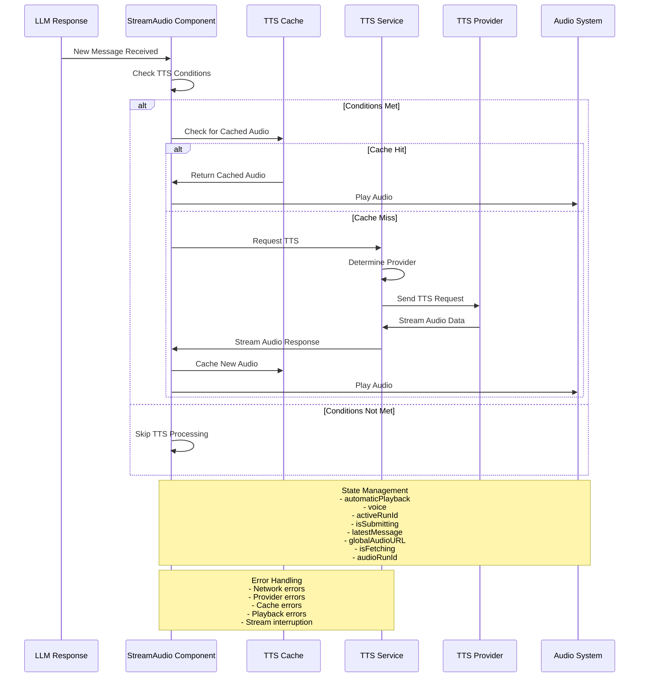

```mermaid
sequenceDiagram
    participant LLM as LLM Response
    participant StreamAudio as StreamAudio Component
    participant Cache as TTS Cache
    participant Server as TTS Service
    participant Provider as TTS Provider
    participant Audio as Audio System

    LLM->>StreamAudio: New Message Received
    StreamAudio->>StreamAudio: Check TTS Conditions
    alt Conditions Met
        StreamAudio->>Cache: Check for Cached Audio
        alt Cache Hit
            Cache->>StreamAudio: Return Cached Audio
            StreamAudio->>Audio: Play Audio
        else Cache Miss
            StreamAudio->>Server: Request TTS
            Server->>Server: Determine Provider
            Server->>Provider: Send TTS Request
            Provider->>Server: Stream Audio Data
            Server->>StreamAudio: Stream Audio Response
            StreamAudio->>Cache: Cache New Audio
            StreamAudio->>Audio: Play Audio
        end
    else Conditions Not Met
        StreamAudio->>StreamAudio: Skip TTS Processing
    end

    Note over StreamAudio,Audio: State Management<br/>- automaticPlayback<br/>- voice<br/>- activeRunId<br/>- isSubmitting<br/>- latestMessage<br/>- globalAudioURL<br/>- isFetching<br/>- audioRunId

    Note over StreamAudio,Server: Error Handling<br/>- Network errors<br/>- Provider errors<br/>- Cache errors<br/>- Playback errors<br/>- Stream interruption
``` 