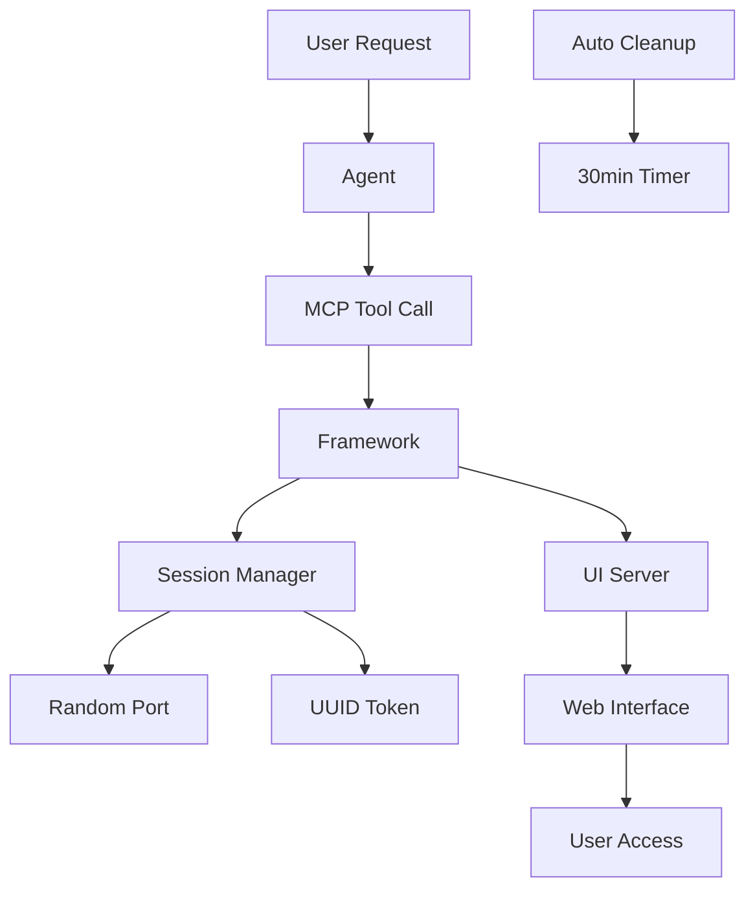

# MCP Web UI Framework

🌐 A dynamic, session-based web UI framework for MCP servers with on-demand interface generation and seamless remote access.

## 🎯 Core Concept

The MCP Web UI Framework enables **dynamic web interfaces** for MCP servers using the "agent as traffic cop" pattern. Instead of persistent UIs consuming resources, interfaces are spun up on-demand, used, and automatically cleaned up.

### Why Dynamic UIs?

- **🚀 Resource Efficient**: UIs only exist when actively needed
- **🔒 Perfect Security**: Temporary sessions with automatic expiration
- **⚡ Zero Conflicts**: Dynamic port allocation prevents collisions
- **🧩 User Isolation**: Each session is completely isolated
- **🎯 Fresh State**: New UI per session eliminates stale data

## 🏗️ Architecture



### The Flow

1. **User**: "Show me my todoodles dashboard"
2. **Agent**: Calls `get_web_ui` MCP tool
3. **Framework**: Allocates random port (e.g., 8347), generates UUID token
4. **Response**: `http://localhost:8347?token=abc123-def456-789`
5. **User**: Accesses temporary web interface
6. **Cleanup**: Automatic shutdown after 30 minutes

## 🚀 Quick Start

### Installation

```bash
npm install @sizzek/mcp-web-ui
```

### Basic Integration

```typescript
import { MCPWebUI, UISchema } from '@sizzek/mcp-web-ui';

// Your existing MCP server
class YourMCPServer {
  private webUI: MCPWebUI;

  constructor() {
    // Initialize web UI
    this.webUI = new MCPWebUI({
      dataSource: (userId?: string) => this.getData(userId),
      schema: this.createUISchema(),
      onUpdate: (action, data, userId) => this.handleUpdate(action, data, userId)
    });
  }

  // Add to your existing tool definitions
  getToolDefinitions() {
    return [
      // ... your existing tools
      this.webUI.getMCPToolDefinition()
    ];
  }

  // Add to your existing tool handler
  async handleToolCall(name: string, args: any) {
    switch (name) {
      // ... your existing cases
      case 'get_web_ui':
        return await this.webUI.handleGetWebUI(args.user_id || 'default');
    }
  }

  private createUISchema(): UISchema {
    return {
      title: "My Dashboard",
      description: "Manage your data efficiently",
      components: [{
        type: "list",
        id: "data-list",
        config: {
          fields: [
            { key: "id", label: "ID", type: "text" },
            { key: "text", label: "Description", type: "text" },
            { key: "completed", label: "Done", type: "checkbox", editable: true }
          ]
        }
      }]
    };
  }
}
```

## 🌐 Remote Access Configuration

**Key Feature**: Access your MCP web UIs from mobile devices over Tailscale, VPN, or local networks.

### Environment Configuration

```bash
# Local access only (default)
MCP_WEB_UI_BASE_URL=localhost

# Tailscale network access
MCP_WEB_UI_BASE_URL=100.64.0.100
MCP_WEB_UI_BASE_URL=myserver.tailnet.ts

# Local network access  
MCP_WEB_UI_BASE_URL=192.168.1.100

# VPN or custom network
MCP_WEB_UI_BASE_URL=your-server-ip
```

### Smart Binding Logic

The framework automatically handles network binding:
- **localhost**: Binds to `127.0.0.1` (local only)
- **Any other URL**: Binds to `0.0.0.0` (all network interfaces)

This enables seamless remote access without manual configuration.

## 🔧 Configuration Options

```typescript
interface MCPWebUIConfig {
  // Required
  dataSource: (userId?: string) => Promise<any[]>;
  schema: UISchema;
  onUpdate: (action: string, data: any, userId: string) => Promise<any>;
  
  // Optional
  sessionTimeout?: number;    // Default: 30 minutes (in ms)
  pollInterval?: number;      // Default: 2 seconds (in ms)
  portRange?: [number, number]; // Default: [3000, 65535]
  baseUrl?: string;          // Default: 'localhost'
  bindAddress?: string;      // Auto-determined from baseUrl
  enableLogging?: boolean;   // Default: true
}
```

## 📋 UI Schema System

Define your interfaces declaratively:

```typescript
const schema: UISchema = {
  title: "Todo Dashboard",
  description: "Manage your tasks efficiently",
  components: [{
    type: "list",
    id: "todo-list",
    config: {
      fields: [
        { key: "id", label: "ID", type: "text" },
        { key: "text", label: "Task", type: "text" },
        { key: "completed", label: "Done", type: "checkbox", editable: true },
        { 
          key: "priority", 
          label: "Priority", 
          type: "badge",
          format: (value: string) => value.toUpperCase()
        },
        { key: "category", label: "Category", type: "text" },
        { 
          key: "dueDate", 
          label: "Due", 
          type: "date",
          format: (value: string) => value ? new Date(value).toLocaleDateString() : ''
        }
      ],
      sortable: true,
      filterable: true
    }
  }],
  actions: [{
    id: "toggle",
    label: "Toggle Complete",
    type: "inline",
    handler: "toggle"
  }]
};
```

## 🔒 Session Management

### Automatic Duplicate Prevention

The framework prevents multiple sessions per user:
- **New session request**: Automatically terminates existing user sessions
- **Clean slate**: Each new UI gets fresh state and resources
- **Resource efficiency**: No accumulation of abandoned sessions

### Session Lifecycle

```typescript
// Session creation
const session = await webUI.createSession(userId);

// Automatic cleanup features:
// - Port deallocation
// - Server shutdown  
// - Token invalidation
// - Memory cleanup

// Manual session termination
await webUI.terminateSession(sessionId);
```

### Activity-Based Expiration

- **User actions** (POST requests, updates) extend session lifetime
- **Polling requests** do NOT extend sessions (prevents infinite sessions)
- Sessions expire 30 minutes after last meaningful user interaction

## 🎨 Built-in Components

### List Component
- ✅ Interactive checkboxes with custom actions
- ✅ Badge display with formatting
- ✅ Sortable and filterable data
- ✅ Real-time data polling
- ✅ Responsive mobile layout
- ✅ Priority-based sorting
- ✅ Completed item filtering

### Component Types Available
- **list**: Interactive data lists with actions
- **form**: Input collection (planned)
- **table**: Advanced data grids (planned)
- **stats**: Metrics display (planned)

## 🔍 Monitoring & Debugging

### Real-time Stats

```typescript
const stats = webUI.getStats();
console.log(stats);

// Output:
{
  totalSessions: 2,
  usedPorts: [3021, 3047],
  activeServers: 2,
  sessionsByUser: { "user1": 1, "user2": 1 },
  uniqueUsers: 2,
  nextExpiry: 1640995200000
}
```

### Structured Logging

```typescript
// Framework provides detailed logging with prefixes
[MCPWebUI] Creating session for user user1
[SessionManager] Allocated port 8347 for session abc123
[UIServer] Starting server on 0.0.0.0:8347
[UIServer] Authentication successful for token abc123
[SessionManager] Session abc123 expired, cleaning up resources
```

## 🧩 Real-World Integration Pattern

Based on the actual working todoodles integration:

```typescript
// 1. Create separate Web UI manager class
export class TodoWebUIManager {
  private webUI: MCPWebUI<TodoItem>;

  constructor(private dataManager: TodoDataManager) {
    this.webUI = new MCPWebUI({
      dataSource: this.getDataSource.bind(this),
      schema: this.createUISchema(),
      onUpdate: this.handleUIUpdate.bind(this),
      baseUrl: process.env.MCP_WEB_UI_BASE_URL || 'localhost'
    });
  }

  getMCPToolDefinition() {
    return this.webUI.getMCPToolDefinition();
  }

  async handleGetWebUI(userId: string) {
    return this.webUI.handleGetWebUI(userId);
  }

  async cleanup() {
    await this.webUI.shutdown();
  }

  private async getDataSource(userId?: string): Promise<TodoItem[]> {
    const allTodos = await this.dataManager.getTodos(userId);
    
    // Filter and sort for clean UI display
    const incompleteTodos = allTodos.filter(todo => !todo.completed);
    return this.sortByPriority(incompleteTodos);
  }

  private async handleUIUpdate(action: string, data: any, userId: string) {
    switch (action) {
      case 'toggle':
        return await this.dataManager.toggleTodo(data.id, userId);
      case 'delete':
        return await this.dataManager.deleteTodo(data.id, userId);
      default:
        throw new Error(`Unknown action: ${action}`);
    }
  }
}

// 2. Integrate with existing MCP server
class ExistingMCPServer {
  private webUIManager: TodoWebUIManager;

  constructor() {
    this.webUIManager = new TodoWebUIManager(this.dataManager);
  }

  getTools() {
    return [
      ...this.existingTools,
      this.webUIManager.getMCPToolDefinition()
    ];
  }

  async handleTool(name: string, args: any) {
    switch (name) {
      case 'get_web_ui':
        return await this.webUIManager.handleGetWebUI(args.user_id || 'default');
      // ... existing cases
    }
  }

  async cleanup() {
    await this.webUIManager.cleanup();
    // ... existing cleanup
  }
}
```

### Integration Benefits

- **Clean Separation**: Web UI logic isolated from core server
- **Minimal Changes**: Add ~3 integration points to existing servers
- **Full Isolation**: UI concerns don't pollute business logic
- **Easy Removal**: Web UI can be disabled without affecting core functionality

## 🚀 Production Ready Features

### Resource Management
- ✅ **Automatic Port Allocation**: Prevents conflicts across servers
- ✅ **Memory Cleanup**: Proper garbage collection and resource deallocation
- ✅ **Server Lifecycle**: Clean startup and shutdown with error handling
- ✅ **Session Isolation**: Complete separation between users and sessions

### Security
- ✅ **Token Authentication**: UUID-based session tokens
- ✅ **Activity-Based Expiration**: Sessions expire based on actual usage
- ✅ **Input Validation**: All user input sanitized in update handlers
- ✅ **Network Isolation**: Each session gets its own port

### Reliability
- ✅ **Automatic Cleanup**: Sessions self-terminate without manual intervention
- ✅ **Error Recovery**: Graceful handling of server and network failures
- ✅ **Duplicate Prevention**: One session per user maximum
- ✅ **Monitoring**: Comprehensive stats and logging for debugging

## 🎯 Best Practices

### Development
1. **Data Source Functions**: Always accept optional `userId` parameter
2. **Update Handlers**: Validate all input and return meaningful responses
3. **Error Handling**: Provide fallbacks and clear error messages
4. **Separation of Concerns**: Keep web UI logic in separate manager classes

### Deployment
1. **Environment Variables**: Configure `MCP_WEB_UI_BASE_URL` for remote access
2. **Resource Monitoring**: Watch port allocation and active session counts
3. **Network Configuration**: Ensure firewall allows dynamic port range
4. **Session Limits**: Monitor user session patterns for capacity planning

### Security
1. **Input Validation**: Sanitize all data in update handlers
2. **Network Access**: Configure base URLs appropriately for your security model
3. **Session Monitoring**: Track unusual session creation patterns
4. **Regular Cleanup**: Verify automatic cleanup is functioning correctly

## 🔄 Framework Architecture

### Core Components

```typescript
// Session lifecycle management
class SessionManager {
  createSession(userId: string): WebUISession
  getSessionByToken(token: string): WebUISession | null
  getSessionByUserId(userId: string): WebUISession | null
  terminateSession(sessionId: string): boolean
  cleanupExpiredSessions(): void
}

// Individual UI server instances
class UIServer {
  constructor(session, schema, dataSource, updateHandler, pollInterval, bindAddress)
  start(): Promise<void>
  stop(): Promise<void>
  // Internal: routing, authentication, data handling
}

// Main orchestrator
class MCPWebUI {
  createSession(userId: string): Promise<WebUISession>
  handleGetWebUI(userId: string): Promise<MCPResponse>
  getStats(): SessionStats
  shutdown(): Promise<void>
}
```

### Data Flow

```
User Request → Agent → MCP Tool → MCPWebUI.handleGetWebUI()
                                       ↓
SessionManager.createSession() ← Clean up existing user session
     ↓
Port Allocation + Token Generation
     ↓
UIServer.start() → Express Routes → Alpine.js Frontend
     ↓
Polling Loop ← REST API ← Update Handlers ← Data Source
     ↓
Automatic Cleanup ← Activity Timeout ← Session Manager
```

## 📱 Mobile Experience

Optimized for mobile access over networks like Tailscale:

- **📱 Responsive Design**: Adapts to all screen sizes automatically
- **👆 Touch-Friendly**: Large touch targets and intuitive gestures
- **⚡ Fast Loading**: Minimal JavaScript with Alpine.js
- **🌓 Dark Mode**: Automatic dark theme support
- **📶 Network Resilient**: Handles mobile network conditions

## 🛠️ Troubleshooting

### Common Issues

**Port Conflicts**
```typescript
// Configure restricted port range if needed
new MCPWebUI({
  portRange: [8000, 9000],
  // ... other config
});
```

**Remote Access Not Working**
```bash
# Ensure base URL is configured
export MCP_WEB_UI_BASE_URL=your-tailscale-ip

# Test connectivity
curl http://your-tailscale-ip:8347/health
```

**Sessions Not Cleaning Up**
```typescript
// Check session stats
const stats = webUI.getStats();
console.log('Active sessions:', stats.totalSessions);
console.log('Next cleanup:', new Date(stats.nextExpiry));

// Force cleanup if needed
await webUI.shutdown();
```

**Data Not Loading**
```typescript
// Verify data source function signature
dataSource: async (userId?: string) => {
  // Must accept optional userId parameter
  return await this.getData(userId);
}
```

## 🚀 Current Status & Roadmap

### Working Features ✅
- Dynamic session creation and management
- Remote access over Tailscale/VPN/local networks
- Interactive list components with real-time updates
- Automatic session cleanup and resource management
- User isolation and duplicate session prevention
- Token-based authentication with activity tracking
- Priority sorting and completed item filtering

### In Development 🚧
- UI responsiveness improvements (scroll position, transitions)
- WebSocket support for real-time updates
- Advanced form components
- Enhanced mobile optimizations

### Planned Features 📋
- Dashboard layouts with multiple components
- Chart and visualization components
- Bulk operations and advanced filtering
- Export capabilities and offline support

## 🤝 Contributing

The framework is designed to be:
- **Simple**: Minimal integration with existing MCP servers
- **Flexible**: Extensible schema and component system
- **Reliable**: Robust session and resource management
- **Performant**: Low overhead with automatic cleanup

## 📄 License

ISC License

---

**🔧 Built for MCP** • **⚡ Powered by Alpine.js** • **🎯 TypeScript Ready** • **📱 Mobile First** 